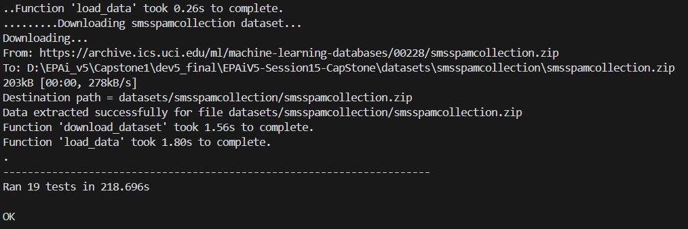
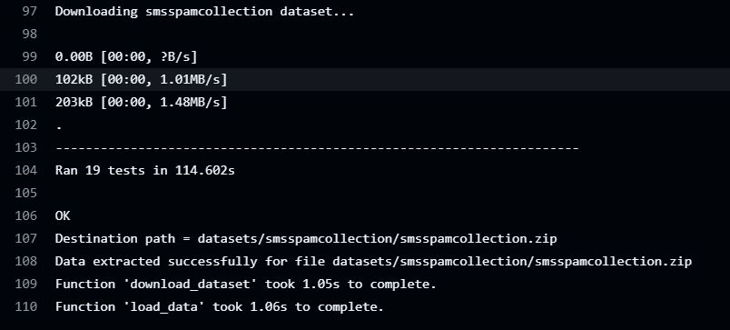

# EPAiV5 - Capstone 1 - DataLoader Package

## Overview
The DataLoader package is designed to facilitate the efficient loading, preprocessing, and augmentation of datasets from various sources. It supports multiple file formats and provides functionalities for batch processing, data augmentation, and extensibility to accommodate new data types and sources. The package is organized into several modules: dataloader.py, utils.py, preprocessors.py, and test_dataloader.py.

### Features

- Supports multiple datasets (MNIST, CIFAR-10, csv, Text)
- Automatic dataset downloading and extraction
- Customizable preprocessing and data augmentation
- Efficient data loading with batching and shuffling
- Comprehensive unit tests
- CI/CD integration with GitHub Actions

### Project Structure

```
├───dataloader
│   ├───__init__.py
│   ├───dataloader.py
│   ├───preprocessors.py   
│   ├───utils.py
│ 
├───main.py 
├───tests     
│   ├───test_dataloader.py  
│   
└───requirements.txt
```

### Modules
#### `dataloader.py`
This module contains the `DataLoader` class, which is responsible for downloading, loading, and preprocessing datasets. It supports batch processing and shuffling of data.

##### Key Features:
- **Downloading Datasets:** Downloads datasets from online sources if they are not already present locally.
- **Handling Different File Formats:** Organizes data appropriately based on the file format (e.g., IDX, CSV, text).
- **Batch Processing:** Provides data in batches for efficient processing.
- **Data Augmentation and Preprocessing:** Supports data augmentation and preprocessing steps.
- **Extensibility:** Designed to accommodate new data types and sources.

#### `utils.py`
This module contains utility functions for downloading files, reading different file formats, and timing function execution.

##### Key Features:
- **Downloading Files:** Downloads files from URLs or copies local files to a destination path.
- **Reading File Formats:** Reads IDX, CSV, and text files.
- **Timing Functions:** Implements a decorator to log the time taken for data loading and preprocessing.

#### `preprocessors.py`
This module contains functions for preprocessing and augmenting data.

##### Key Features:
- **Default Preprocessing:** A no-op preprocessing function that returns the sample unchanged.
- **Normalization:** Normalizes image data to a range of [0, 1].
- **Image Augmentation:** Augments images by applying random rotations and horizontal flips.
- **Text Augmentation:** Augments text samples by randomly swapping words.

#### `test_dataloader.py`
This module contains unit tests for the DataLoader class and its functionalities.

##### Key Features:
- **Unit Tests:** Tests for downloading, loading, and preprocessing datasets.
- **Test Coverage:** Ensures that the DataLoader class handles different datasets and file formats correctly.

### Implementation Details
The Python concepts implemented in this assignment are - Object-Oriented Programming, decorators (`@timer`), Context Managers, Generators and Iterators
List Comprehensions, Error Handling, File I/O and Binary Data Handling, command-line argument parsing, interning, Modular Project Structure, Unit Testing, CI/CD Integration. High level implementation details are as follows - 

1. Downloading Datasets from Online Sources
The `DataLoader` class checks if the dataset exists locally. If not, it calls the download_dataset method, which downloads the dataset from the specified URL using the `gdown` library. The `download_file` function in `utils.py` handles the actual download and decompression of files. It supports .gz, .tar, and .zip formats.

2. Handling Different File Formats and Organizing Data
The read_data method in the DataLoader class reads data based on the dataset name. It uses different functions from utils.py to read IDX, CSV, and text files. The data is organized into DataSample namedtuples, which contain features and labels.

3. Providing Data in Batches for Efficient Processing
The DataLoader class implements the iterator protocol. The `__iter__` method initializes the iterator and shuffles the data if specified. The `__next__` method returns the next batch of data. This allows for efficient processing of large datasets without loading all data into memory at once.

4. Supporting Data Augmentation and Preprocessing Steps
The `preprocess_data` method in the DataLoader class applies preprocessing functions to the data. The preprocessing functions are defined in `preprocessors.py`. These functions include normalization, image augmentation, and text augmentation. The preprocess_func parameter allows users to specify custom preprocessing functions.

5. Extensibility to Accommodate New Data Types and Sources
The DataLoader class is designed to be extensible. New datasets can be added by extending the read_data method to handle new file formats. Custom preprocessing functions can be passed via the preprocess_func parameter. The use of `**kwargs` allows for flexible method signatures, accommodating additional parameters for data transformations.

### Install dependencies
   ```
   pip install -r requirements.txt
   ```

### Usage

To use the `DataLoader`:

```python
from dataloader import DataLoader
#Initialize DataLoader
data_loader = DataLoader(dataset_name='MNIST', batch_size=32)
#Iterate over data
for batch in data_loader:
    # Process the batch
    print(f"Processing batch of size {len(batch)}")
```

### Running Tests

To run the unit tests, run the following command
```
python -m unittest discover tests
```

### Summary
#### What is implemented?
- Dataset loader for `MNIST`, `CIFAR-10`, CSV data and text data
- Key concepts and best practices learnt so far for flexible and efficient handling of Datasets

#### What is not implmeneted?
- Preprocessing for Text (NLP), CSV data

## Test Results
### Results - Local PC Testing



### Results - Git Actions



## Conclusion
The DataLoader package provides a comprehensive solution for loading, preprocessing, and augmenting datasets from various sources. It is designed to be efficient, extensible, and easy to use, making it suitable for a wide range of machine learning tasks.

---------------------------------------------------------------------------------------------------------------------------------------------------

**Submission by** - Hema Aparna M

**mail id** - mhema.aprai@gmail.com

---------------------------------------------------------------------------------------------------------------------------------------------------
